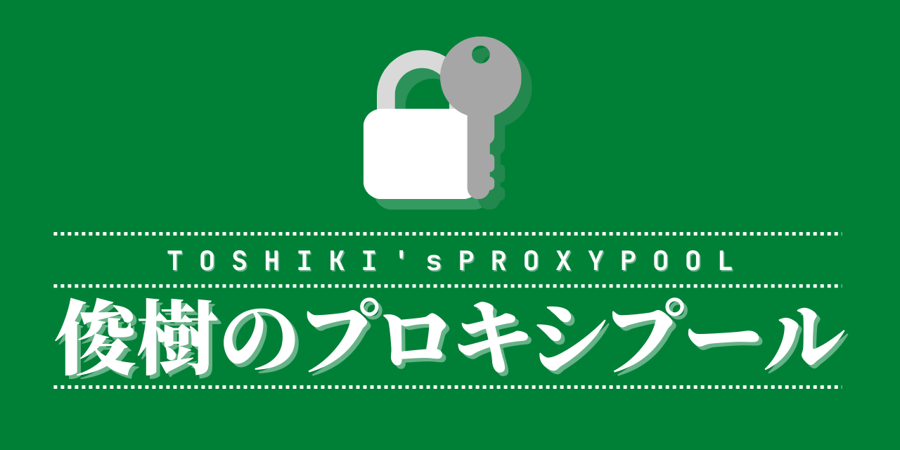

<figure>
</img>
<figcaption align="center"><small>social image created on <a href="https://canva.cn/">Canvas</a></small></figcaption>
</figure>
<h1 align="center">
  🌐 Toshiki's Proxy Pool
</h1>

<h5 align="center">Automatically crawl SS, SSR, vmess, trojan node info from web, Telegram Channels, and localize/integrate into a web panel for convenient usages.</h5>

<p align="center"><a href="">繁體中字</a> | 日本語</p>

<p align="center">
  <!-- wakatime stats -->
  </img>
  <!-- social info -->
  <a href="https://t.me/awesomeandatoshiki">
    </img>
  </a>
  <!-- github action stats -->
  <a href="https://github.com/andatoshiki/toshiki-proxypool/actions">
    
  </a>
  <!-- go report stats -->
  <a href="https://goreportcard.com/report/github.com/andatoshiki/toshiki-proxypool">
    
  </a>
  <!-- github release stats -->
  <a href="https://github.com/andatoshiki/toshiki-proxypool/releases">
    
  </a>
</p>

---

## 🚫 1-1 RBYP <small>(Read before you proceed)</small>

> **⚠**: Note that this project was **originally** from **[sansui233](https://github.com/Sansui233/proxypool)** licensed under **[GNU](https://www.gnu.org/licenses/licenses.en.html)** for project derivational development yet distribution; As required by original developers, project content contained under [proxypool](https://github.com/Sansui233/proxypool) and its affiliates **MUST** be copyleft yet pointing the credit of the original developer. *Hence this project and its assets in contained is a new branch & version published and secondarily developed from the original project*, please understand and ensure copywrites are **pointing the original author** for your own development.

- ***The original author is no longer maintaining the original project, thus this project exists.***

- **Issues function will be disabled in this repository for preventing further affairs and issues from happening.**

---

## 💦 2-1 What is [toshiki-proxypool](https://github.com/andatoshiki/toshiki-proxypool/)?

Toshiki's proxypool contains a complete suite of SS, SSR, vmess, trojan node crawler written in GoLang and complied into a compiled into a Linux image for VPS deployment, you can also try deployment for Heroku, completely free to use, see the next section for further info.

### 💌 2-2 What does it support?

- **🧩 Extensible**: Support SSS, SSR, vmess, trojan & a variable types of nodes.
- **💬 Telegram**: Telegram channel sniffer & crawling.
- **🎲 Featured**: Support address subscription sniffer, analysis & crawling.
- **🌐 Web**: Open network vague crawling.
- **🕒 Cron**: Timed crawling & updates supported via `cron` job.
- **🎨 Customizable**: Customizable crawl source via configuration `yaml` file.
- **🎀 Automated**: Automatically detect uptime and availability of nodes.
- **🎯 Convenient**: Serve direct config files for clash, surge for importation.
- **🔮 Subscription**: Provide direct SS, SSR, vmess, sip002 subscription.
- **🎠 Deployable**: Easy deployment, **VPS/Heroku/Local/Docker** deployment supported.

## 🔽 3-1 Installation

### 🎫 3-1 [Heroku](https://www.heroku.com/)

### 

Click the button below and fill in the basic information
点击按钮进入部署页面，填写基本信息然后运行

其中 `DOMAIN` 需要填写为你需要绑定的域名，`CONFIG_FILE` 需要填写你的配置文件路径。

> heroku app域名为appname.herokuapp.com。项目内配置文件为./config/config.yaml

配置文件模板见 `config/config.yaml` 文件，可选项区域均可不填。完整配置选项请查看[配置文件说明](https://github.com/andatoshiki/toshiki-proxypool/wiki/%E9%85%8D%E7%BD%AE%E6%96%87%E4%BB%B6%E8%AF%B4%E6%98%8E)。

[](https://heroku.com/deploy)

> 因为爬虫程序需要持续运行，所以至少选择 $7/月 的配置
> 免费配置长时间无人访问会被heroku强制停止

### 从源码编译

需要安装Golang 

```sh
$ go get -u -v github.com/andatoshiki/toshiki-proxypool
```

运行

```sh
$ go run main.go -c ./config/config.yaml
```

编译

```
make
```

### 下载预编译程序

从这里下载预编译好的程序 [release](https://github.com/andatoshiki/toshiki-proxypool/releases)。

### 使用docker

```sh
docker pull docker.pkg.github.com/andatoshiki/toshiki-proxypool/proxypool:latest
```

## 使用

运行该程序需要具有访问完整互联网的能力。

### 修改配置文件

首先修改 config.yaml 中的必要配置信息。带有默认值的字段均可不填写。完整的配置选项见[配置文件说明](https://github.com/andatoshiki/toshiki-proxypool/wiki/%E9%85%8D%E7%BD%AE%E6%96%87%E4%BB%B6%E8%AF%B4%E6%98%8E)

### 启动程序

使用 `-c` 参数指定配置文件路径，支持http链接

```shell
proxypool -c ./config/config.yaml
```

如果需要部署到VPS，更多细节请[查看wiki](https://github.com/andatoshiki/toshiki-proxypool/wiki/%E9%83%A8%E7%BD%B2%E5%88%B0VPS-Step-by-Step)。

## Clash配置文件

远程部署时Clash配置文件访问：https://domain/clash/config

本地运行时Clash配置文件访问：http://127.0.0.1:[端口]/clash/localconfig

## 本地检查节点可用性

此项非必须。为了提高实际可用性，可选择增加一个本地服务器，检测远程proxypool节点在本地的可用性并提供配置，见[proxypoolCheck](https://github.com/andatoshiki/toshiki-proxypoolCheck)。

## 截图


## 声明

本项目遵循 GNU General Public License v3.0 开源，在此基础上，所有使用本项目提供服务者都必须在网站首页保留指向本项目的链接

本项目仅限个人自己使用，禁止使用本项目进行营利和做其他违法事情，产生的一切后果本项目概不负责
